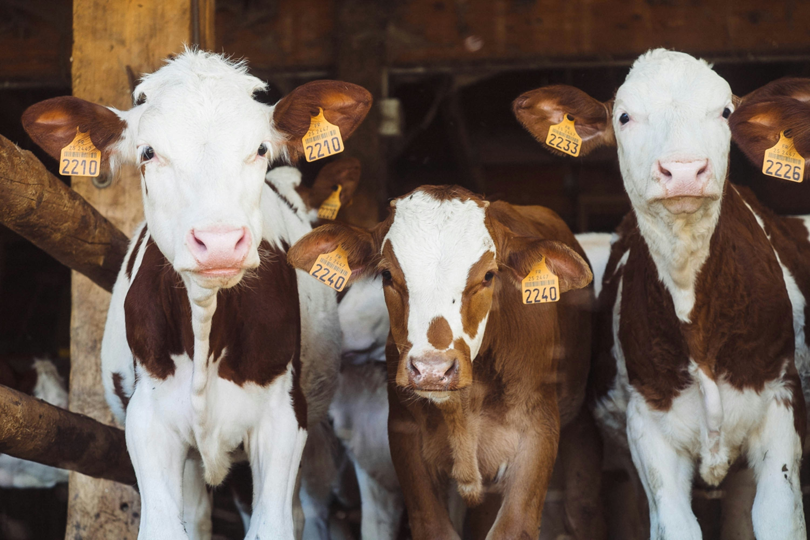

# Peter's Farm


## Ukulima ni Msingi wa Maisha Yetu

Discover a new way to manage and enhance your farming operations. This app is designed to support farmers by providing easy access to key tools and resources that improve efficiency, productivity, and decision-making. From tracking crops and livestock to streamlining day-to-day tasks, this app is built with the unique needs of the farming community in mind. Simplify your workflow and stay connected to your farm, no matter where you are.

## Table of Contents
- [Home](#home)
- [About](#about)
- [Services](#services)
- [Team](#team)
- [Contact](#contact)

## Home

### Subscribe
Stay updated with our latest news and offers.
```html
<form class="header-form">
    <input type="email" placeholder="Enter your email" required>
    <button type="submit">Subscribe</button>
</form>
```

## About

### Our Mission & Vision
- **Mission:** To empower farmers with sustainable solutions for a better tomorrow.
- **Vision:** A world where every farmer thrives with eco-friendly practices.




## Services

### Our Services
- **Crop Management:** Stay ahead of the weather with our accurate and timely forecasts tailored for farmers.
- **Livestock Tracking:** Keep track of your livestock with our easy-to-use tracking system.
- **Market Insights:** Get the latest market trends and insights to make informed decisions.
- **Equipment Rentals:** Rent the latest farming equipment to enhance your productivity.
- **Consulting Services:** Get expert advice and consulting services to improve your farming practices.
- **Soil Testing:** Analyze soil health and get recommendations for optimal crop growth.

## Contact

### Contact Us
Stay updated with our latest news and offers.
```html
<form>
    <input type="email" placeholder="Enter your email" required>
    <button type="submit" class="contact-button">Subscribe</button>
    <p>Stay updated with our latest news and offers.</p>
</form>
```

## Footer
&copy; 2025 Peter's Farm